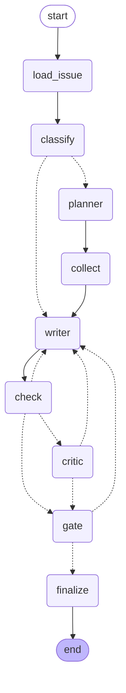

# graph-issue-triage

A small, complete example of one idea: **the graph is the unit of engineering; a model is just a node.**

It triages a public GitHub issue. Nine nodes, three kinds of model, one human gate. Every decision
is made at the cheapest layer that can make it:

| Layer | Cost | Used for |
|---|---|---|
| **code** | free, deterministic | fetching, capping, validating citations, routing, rendering |
| **decision model** (TypeSafe Jev) | ~cents per thousand calls, returns probabilities, cannot write | "which category?", "does this need code?", "is each rubric rule met?" |
| **small generative model** | cheap | planning: bounded output, cheap to get slightly wrong |
| **big generative model** | expensive | writing the triage, and judging only the drafts the cheaper layers could not settle |



Dotted edges are decisions. Every one of them is a Python function reading typed state and a
threshold from [`config.py`](src/graph_issue_triage/config.py). No prompt owns a loop bound.

## The nodes

| Node | Layer | What it does |
|---|---|---|
| [`load_issue`](src/graph_issue_triage/nodes/load_issue.py) | code | Fetches the issue and the repo's top-level listing. |
| [`classify`](src/graph_issue_triage/nodes/classify.py) | decision | One `choice` (category, with confidence) and one `noul` ("does answering need the code?"). Produces a `Prior`. |
| [`planner`](src/graph_issue_triage/nodes/planner.py) | small LLM | Up to 3 hypotheses and the evidence requests to test them. Typed `Plan`. |
| [`collect`](src/graph_issue_triage/nodes/collect.py) | code | Executes the plan against GitHub. Caps requests. A failed fetch is evidence, not an exception. |
| [`writer`](src/graph_issue_triage/nodes/writer.py) | big LLM | Writes the triage from issue + prior + evidence + every rejection so far. Typed `Triage`. |
| [`check`](src/graph_issue_triage/nodes/check.py) | code, then decision | First a validator: a draft that cites evidence never collected is rejected without any model. Then one `noul` per rubric rule. Code turns the probabilities into a verdict: `reject`, `pass` or `uncertain`. |
| [`critic`](src/graph_issue_triage/nodes/critic.py) | big LLM | Generative judgment, paid only for `uncertain` drafts. Sees the rubric probabilities. |
| [`gate`](src/graph_issue_triage/nodes/gate.py) | human | `interrupt()`. The run is checkpointed and stops. A person approves or rejects with feedback from the CLI. |
| [`finalize`](src/graph_issue_triage/nodes/finalize.py) | code | Writes `triage.md` with the whole review trail. |

Routing, in [`graph.py`](src/graph_issue_triage/graph.py):

- `classify -> writer` only when P(needs code) is at or below `skip_code_below`; otherwise `-> planner`.
- `check -> writer` on `reject` while the round budget lasts, `-> gate` on `pass` or when the
  budget is exhausted, `-> critic` on `uncertain`.
- `critic -> writer` on rejection within budget, `-> gate` otherwise.
- `gate -> finalize` on approval; `-> writer` on rejection, with the human feedback appended to the
  same `reviews` list the validator, the rubric and the critic write to, and the budget reset.

## The decision model

[Jev](https://www.typesafe.ai) (TypeSafe AI, "System One") is not a chat model. You send a `state`
and typed `questions`; it returns calibrated probabilities. Three question types: `noul` (a yes/no
statement, answered with P(yes)), `choice` (one of up to 255 options, with per-option probabilities
and a confidence), `score` (an ordered scale). It cannot write a sentence, which is the point:
a node that can only decide cannot drift into doing the writer's job.

Two places in this graph want a decision and nothing else:

1. **Before any evidence**: what kind of issue is this, and do we need to read code at all?
   The answer routes the graph. A confident "no code" saves the planner, the collector and the
   GitHub calls.
2. **After every draft**: is each rubric rule met? One `noul` per rule, never a combined
   judgment. Code reads the probabilities against two thresholds. Clear fail → rejection with
   feedback templated from the rule that failed. Clear pass → straight to the human. Anything in
   between → the big model earns its price.

Without `TYPESAFE_API_KEY` the decider returns `None` and the graph takes the full generative
path on every decision. Jev can never block a run. The client is
[`jev.py`](src/graph_issue_triage/jev.py), the thresholds are in `Settings`, and the question
builders are plain dicts you can read in one screen.

## Run it

```bash
cp .env.example .env            # models per role, API keys, thresholds
uv sync
uv run triage run octocat/Hello-World#1
```

The run stops at the gate and prints the prior, the rubric probabilities, the draft and a thread id:

```
thread: 3f9c1a2b7d4e
approve: triage resume 3f9c1a2b7d4e --approve
reject:  triage resume 3f9c1a2b7d4e --reject "what to change"
```

Resume whenever you want, from any shell. State is in SQLite under `.triage/`.

```bash
uv run triage resume 3f9c1a2b7d4e --reject "say which function raises"
uv run triage resume 3f9c1a2b7d4e --approve
# written: .triage/runs/3f9c1a2b7d4e/triage.md
```

`TRIAGE_MODEL_*` take any `provider:model` string that LangChain's `init_chat_model` accepts, so a
local small model through Ollama is one line in `.env`. `GITHUB_TOKEN` is optional, but code
search and sane rate limits need one.

## Why the shape matters

- **Deterministic by default.** Four of nine nodes have no model in them, and every edge decision
  is code. Fetching, capping, validating, routing and rendering never drift.
- **Decide with a decider, write with a writer.** Classification and rubric checks are
  probabilities read by code, not prose read by another model. The generative critic only runs on
  what the probabilities could not settle.
- **One model per role, not one model.** The planner is small because its output is bounded and
  cheap to get slightly wrong. The writer and the critic are big because that is where quality is
  paid for. Swapping either is a `.env` change.
- **Humans are a gate, not a chat.** `interrupt()` pauses the graph with a checkpoint. Approval
  is a resume with a value. Nothing is re-run; nothing is lost between sessions.
- **Fakes make it testable.** Nodes receive the models, the decider and the repository as
  dependencies. [`tests/`](tests/) runs the whole graph with scripted answers in a fraction of a
  second: the skip-code route, the three rubric verdicts, the budget, the validator short-circuit,
  the human rejection path, and the no-decider fallback.

```bash
uv run pytest
uv run triage diagram      # regenerates docs/graph.mmd from the real graph
```

## Layout

```
src/graph_issue_triage/
  config.py      models per role, limits and thresholds, from env
  state.py       typed state and the schemas the models must fill
  github.py      Repository protocol + httpx client
  jev.py         Decider protocol + TypeSafe System One client + question builders
  llm.py         StructuredLLM protocol + LangChain adapter + Models (one per role)
  graph.py       nodes wired, routing functions
  cli.py         run / resume / diagram
  nodes/         one file per node
tests/           fakes for the models, the decider and GitHub; full-graph tests
docs/graph.mmd   generated
```

MIT.
