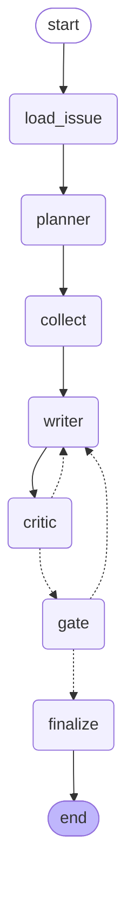

# graph-issue-triage

A small, complete example of a pattern: **the graph is the unit of engineering, the LLM is just a node.**

It triages a public GitHub issue. Seven nodes, two model calls that can loop, one human gate.
Everything that can be decided by code is decided by code: loop bounds, request caps, evidence
validation, routing. The model is asked only for what code cannot produce: hypotheses, a draft,
a review.



Dotted edges are decisions. Solid edges are not.

## The nodes

| Node | Kind | What it does |
|---|---|---|
| [`load_issue`](src/graph_issue_triage/nodes/load_issue.py) | code | Fetches the issue and the repo's top-level listing. |
| [`planner`](src/graph_issue_triage/nodes/planner.py) | model | Up to 3 hypotheses and the evidence requests to test them. Returns a typed `Plan`. |
| [`collect`](src/graph_issue_triage/nodes/collect.py) | code | Executes the plan against GitHub. Caps the number of requests. A failed fetch becomes evidence, not an exception. |
| [`writer`](src/graph_issue_triage/nodes/writer.py) | model | Writes the triage from issue + evidence + every rejection so far. Returns a typed `Triage`. |
| [`critic`](src/graph_issue_triage/nodes/critic.py) | code, then model | First a validator: if the draft cites evidence that was never collected, it is rejected without a model call. Only then the model reviews it. |
| [`gate`](src/graph_issue_triage/nodes/gate.py) | human | `interrupt()`. The run is checkpointed and stops. A person approves or rejects with feedback from the CLI. |
| [`finalize`](src/graph_issue_triage/nodes/finalize.py) | code | Writes `triage.md` with the review trail. |

Routing lives in [`graph.py`](src/graph_issue_triage/graph.py):

- `critic -> writer` while the review is a rejection **and** the round budget is not exhausted;
  `critic -> gate` otherwise. The budget is a setting, not a sentence in a prompt.
- `gate -> finalize` on approval; `gate -> writer` on rejection, with the human feedback appended
  to the same `reviews` list the critic writes to, and the critic budget reset for the new draft.

## Run it

```bash
cp .env.example .env            # set TRIAGE_MODEL and the matching API key
uv sync
uv run triage run octocat/Hello-World#1
```

The run stops at the gate and prints the draft, the last review and a thread id:

```
thread: 3f9c1a2b7d4e
approve: triage resume 3f9c1a2b7d4e --approve
reject:  triage resume 3f9c1a2b7d4e --reject "what to change"
```

Resume whenever you want, from any shell. State is in SQLite under `.triage/`.

```bash
uv run triage resume 3f9c1a2b7d4e --reject "say which function raises"
uv run triage resume 3f9c1a2b7d4e --approve
# written: .triage/runs/3f9c1a2b7d4e/triage.md
```

`TRIAGE_MODEL` takes any `provider:model` string that LangChain's `init_chat_model` accepts.
A `GITHUB_TOKEN` is optional, but code search and sane rate limits need one.

## Why the shape matters

- **Deterministic by default.** Five of seven nodes have no model in them. Fetching, capping,
  validating, routing and rendering are code, so they are testable and never drift.
- **Critic as a node, not a prompt.** The review loop is visible in the diagram, bounded by a
  setting, and its output is a typed object that routing can read.
- **Humans are a gate, not a chat.** `interrupt()` pauses the graph with a checkpoint. Approval
  is a resume with a value. Nothing is re-run; nothing is lost between sessions.
- **Fakes make it testable.** Nodes receive the model and the repository as dependencies.
  [`tests/`](tests/) runs the whole graph with scripted answers in a fraction of a second:
  the critic loop, the budget, the validator short-circuit, the human rejection path.

```bash
uv run pytest
uv run triage diagram      # regenerates docs/graph.mmd from the real graph
```

## Layout

```
src/graph_issue_triage/
  config.py      runtime limits, from env
  state.py       typed state and the schemas the model must fill
  github.py      Repository protocol + httpx client
  llm.py         StructuredLLM protocol + LangChain adapter
  graph.py       nodes wired, routing functions
  cli.py         run / resume / diagram
  nodes/         one file per node
tests/           fakes for the model and GitHub, full-graph tests
docs/graph.mmd   generated
```

MIT.
