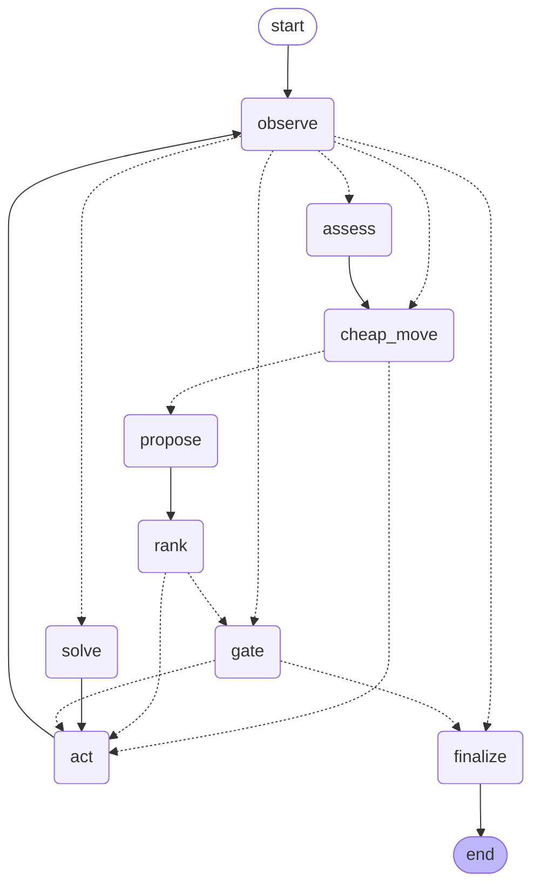
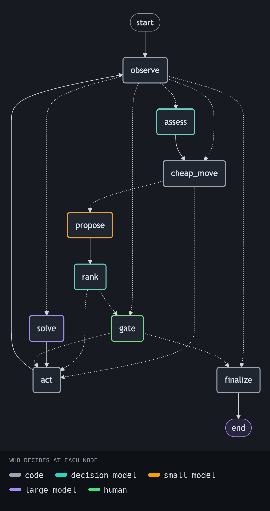
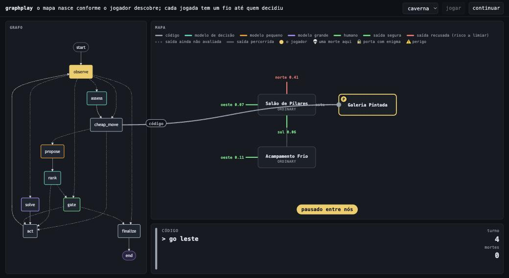

# graphplay

A Go program built around one idea: **the graph is the unit of engineering; a model is just a node.**

The graph plays a text adventure. Every turn it decides the next command at the cheapest layer
that can decide it, and writes down who decided. The final table is the point:

| layer | what it is | decides |
|---|---|---|
| **code** | deterministic, free | the map, the inventory, which exits are unexplored, the walk to the nearest frontier, what is legal, what killed us last time |
| **decision model** ([TypeSafe Jev](https://typesafe.ai)) | probabilities, cannot write | reading the room's prose: what kind of place is this, is walking through that exit lethal right now; which of several proposals to try |
| **small LLM** | cheap, bounded output | proposing candidate commands when code has no safe move left |
| **large LLM** | real reading | the riddle on the carved door, and nothing else |
| **human** | a gate, not a chat | after three deaths, eight idle turns or three wrong answers: the run pauses, saves, and waits |

A clean run of the bundled `caverns` world ends like this:

| player | won | turns | deaths | large-model calls | decision-model calls |
|---|---|---|---|---|---|
| **the graph** | yes | 41 | 0 | 3 (1.1k in / 3.9k out tokens, 58 s) + 1 small-model call | 21 (16k in / 2.7k out, 5 s) |
| one large LLM alone, full transcript as memory | yes | 41 | 1 | 42 (29k in / 27k out, 468 s) | 0 |
| one decision model alone, over the legal commands | no | 34 (stopped at 3 deaths) | 3 | 0 | 34 (17k in, 10 s) |

Same world, same turn budget, same mercy on death (a reload). The LLM alone does solve it: it
also spends a dozen turns walking between the same two rooms, writes 27 thousand tokens of
reasoning to do so, and pays for a large-model call on every turn (another run of it took 49
turns). The decision model alone cannot type an answer to a riddle, so it never
can. The graph puts each decision where it is cheapest and asks the large model three times: two
riddles, and one fork where the decision model was not sure which arch to take (confidence
0.13) and the large model read the inscription. Those numbers, not the game, are what this repository is about. The reports are
written by `play run` and `play baseline`; see "Run it".



Dotted edges are decisions. Every one of them is a Go function reading typed state and a
threshold from [`Config`](internal/player/config.go). No prompt owns a loop bound.



## The runtime is under 500 lines, comments included, and it is yours

There is no LangGraph for Go, and this repo does not try to be one. [`graph/`](graph/) is the
whole control plane:

- `Graph[S]`: named nodes, fixed `Edge`s, and `Route`s whose targets are declared so the
  diagram can draw them and the runner can reject a router that wanders off.
- `Runner[S]`: executes nodes, checkpoints after every one, records how long each took.
  `Continue` retries a run from the node that failed.
- `Interrupt[T](ctx, payload)`: pauses the run with a payload; on resume the node runs again
  and receives a typed answer. A resume value of the wrong type is an error, not a panic.
- `Store[S]`: `FileStore` writes one JSON file per thread with an atomic rename (a save game
  you can `cat`); `MemoryStore` is for tests and round-trips through JSON on purpose.
- `Mermaid()`: deterministic, so `docs/graph.mmd` is committed and CI diffs it.

The package is generic over the state type and knows nothing about models or games.
[`graph/example_test.go`](graph/example_test.go) is a 30-line pipeline that pauses for approval.

## The game

[`internal/world`](internal/world/world.go) is a deterministic text-adventure engine, 250 lines,
with worlds as JSON. It only ever reveals what a player sees: prose, exits, visible items. It never
exposes the map, and dangers live in the prose ("from the west you hear slow, heavy breathing"),
not in structured fields. That is what forces reading. Every game is replayable from its command
log, which is why death is cheap: **reload is a replay without the fatal command.**

Three bundled worlds. [`cellar`](internal/world/worlds/cellar.json): seven rooms, a lantern in the
first one, a passage that kills you in the dark, a troll who takes the coin or you, a riddle door,
a chest. [`caverns`](internal/world/worlds/caverns.json): thirteen rooms, the lantern off the
direct path, an exit that only `look` reveals, two riddles, a toll bridge, a fork where both
arches look lethal and only an inscription says which one is, and a chest.
[`caverna`](internal/world/worlds/caverna.json) is the same map in Brazilian Portuguese: prose,
exits, items, riddles and the engine's own sentences. The models answer in the language of the
game; the decision model's numbers came out the same as in English. The cellar is
good for a first run; the caverns are where the layers earn their keep.

## The player

| node | layer | what it does |
|---|---|---|
| `observe` | code | replays the command log and refreshes what the player sees |
| `assess` | decision | on a new room, or the same room with a new inventory: one `choice` for the kind of place and, per exit, two `noul`s: "the text describes a lethal danger that way" and "the inventory covers it". Code combines them into `risk = danger × (1 − protected)` and keeps every assessment in the room's history. |
| `cheap_move` | code | take what is visible; `look` once on arriving in a room (the only way hidden exits appear); explore a safe unexplored exit; walk the known map (BFS) to the nearest room that still has one; when nothing safe is left, walk to the room with the refused exit and stop there. Most turns end here. |
| `propose` | small LLM | only when code has nothing: 3 to 5 candidate commands |
| `rank` | code, decision, then large | drop illegal and already-failed candidates; one left needs no model; several: Jev picks; a pick below `RankMinConfidence` is escalated to the large model, which reads the prose and explains |
| `solve` | large LLM | a riddle is posed: answer it. The only node that needs real reading. |
| `act` | code | run the command; learn where the exit led; on death, roll the log back one step and remember the command as fatal here, with the inventory it was fatal with |
| `gate` | human | `Interrupt` with the screen and the reason; resume with a command or stop |
| `finalize` | code | write `game.md`: the layer table and every turn |

Routing is in [`internal/player/graph.go`](internal/player/graph.go): a turn is sorted in
priority order (game over; a human is owed a look; a riddle is posed; the room is new; code
moves), and the expensive nodes only run when the cheap ones had nothing to say.

Prompts are `text/template` files in [`internal/player/prompts/`](internal/player/prompts/),
embedded at build time.

Why two questions per exit instead of "is it lethal now?": asked the combined question, the
decision model answered around 0.4 for an unlit tunnel whether or not the player carried a
lantern. Asked the two halves, it separates them (danger 0.45 either way; protected 0.02
without the lantern, 0.44 with it, 0.85 with lantern and coin). The threshold of 0.3 was read
off those numbers, not guessed. One factor per question is also what the vendor recommends.

## Run it

```bash
cp .env.example .env            # provider, API keys, thresholds
go run ./cmd/play run -world caverns
```

The graph plays until it wins, hits the turn limit, or needs you:

```
=== the graph needs you (the riddle resisted every attempt) ===
{ "obs": { "name": "Carved Antechamber", ... }, "recent": [...], "summary": [...] }

thread:  k3fj2m9qpz1a
command: play resume k3fj2m9qpz1a -command "answer echo"
stop:    play resume k3fj2m9qpz1a -stop
```

Resume whenever you want, from any shell. The save game is one JSON file per thread under
`.play/runs/`. The report lands next to it as `game.md`. If a run dies on an external error
(an expired key, a provider outage), `play resume <thread>` with no flags continues from the
node that failed; nothing before it is re-executed.

### Watch it

```bash
go run ./cmd/play serve -world caverna -pace 1200ms   # then open http://127.0.0.1:8080/?lang=pt
```



`/` is a one-screen introduction to the game and the player, with a button into `map.html`,
the one to watch: the player's own map of the world, drawn only from what it has
learned, with every exit coloured by the decision model's verdict and labelled with its risk;
a thread from the node of the graph that decided to the exit or room on the map, in the colour
of the layer; and a card with the why, in one to three lines (the two statements and three
numbers for the decision model, the reasoning for the large model, the rule for code). Deaths
mark the exit with a skull and the player steps back. `-pace` holds each node so a person can
follow; code turns are otherwise microseconds. Space, or the pause button, holds the graph
between two nodes. `audit.html` is the audit view: the full ledger and the model usage as
tables. Both take `?lang=pt` for Portuguese labels and captions; node
and layer names stay as they are in the code. When the graph needs a human, both pages ask. It is the runner's observer
streamed over Server-Sent Events; the only dependency is Mermaid from a CDN, in the page.

### Compare it

```bash
go run ./cmd/play baseline -mode llm -world caverns        # one large model, no graph
go run ./cmd/play baseline -mode decision -world caverns   # one decision model, no graph
```

Both write the same shape of report as the graph, with the same model-usage table, under
`.play/baselines/`. That is where the comparison table at the top comes from.

### Providers

`PLAY_PROVIDER` picks who plays the two generative roles: `deepseek` (default; `deepseek-flash`
proposes, `deepseek-v4-pro` solves, through the OpenAI-compatible endpoint with JSON mode) or
`anthropic` (`claude-haiku-5-5` and `claude-opus-5-5`, through the official SDK with structured
outputs). Both adapters derive the JSON schema from the same Go struct; the graph never sees
the difference.

Without `TYPESAFE_API_KEY` every exit is treated as safe: code explores everything, dies,
reloads, remembers, and still wins. The ledger then shows what the decision model would have
saved. Without a generative key the run fails at the first node that needs one, which in the
bundled world is the riddle; `play resume <thread>` continues from there once the key is in.

## Why the shape matters

- **Deterministic by default.** Five of nine nodes have no model in them, and every edge
  decision is code. The map, the legality filter and the reload never drift.
- **Decide with a decider, generate with a generator.** Reading prose for risk is a judgment,
  not a composition: it returns a probability that code compares to a threshold. Only the
  riddle needs a sentence back.
- **One model per role, not one model.** Proposing commands is bounded and cheap to get
  wrong; solving a riddle is not. Swapping either is a `.env` change.
- **Death is a slice operation.** Because the engine is a replay, reload is `log[:len-1]`
  plus a note. No model is asked to "be more careful".
- **Humans are a gate, not a chat.** `Interrupt` pauses the graph with a checkpoint. The
  human's command runs through the same `act` node as everyone else's and is counted in the
  same ledger.
- **Measured, not asserted.** Every adapter records calls, tokens and time into a meter; the
  report ends with that table. The baselines exist so the graph's numbers have something to
  stand next to.
- **Fakes make it testable.** Nodes receive the models, the decider and the world as values or
  interfaces. [`internal/player`](internal/player/) runs whole games with scripted answers
  under the race detector in well under a second: a code-only win, death and reload, the risk
  assessment preventing a death, a refused exit reconsidered after a new item, the hidden exit
  found by `look`, the proposal path, the decision model choosing among proposals, the riddle
  budget handing over to a human, the human stopping the run.

```bash
make test       # go test -race ./...
make lint       # golangci-lint
make diagram    # regenerates docs/graph.mmd; CI fails if it drifts
```

## Layout

```
cmd/play/              CLI: run / resume / diagram / baseline / serve (+ ui/index.html)
graph/                 the control plane: Graph, Runner, Interrupt, Store, Observer, Mermaid
internal/world/        the engine and its worlds/*.json
internal/player/       the agent: State, nodes, routing, Config, prompts/*.tmpl
internal/baseline/     the same worlds without the graph: one LLM, one decision model
internal/metrics/      calls, tokens and time per model
internal/jev/          Decider interface + System One client + question builders
internal/llm/          Model interface; Anthropic (structured outputs) and OpenAI-compatible (JSON mode) adapters
docs/graph.mmd         generated
```

Dependencies: the official Anthropic Go SDK and `invopop/jsonschema` (the schema the prompts
carry). Everything else is the standard library.

MIT.
